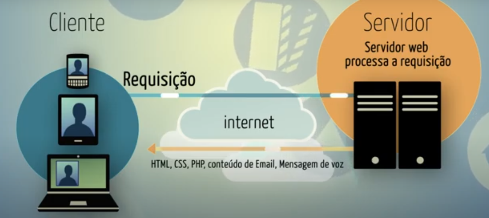

# Web: URL's e requisições

## Capitulo 1 - Introdução


Você sabe como a WEB funciona? Esse curso começa fazendo essa pergunta mostrando como todos os sites seguem padrões comuns. É possivel que muitos deles utilizem as mesmas tecnologias que nós vamos instalar hoje no seu computador, mas não se preocupe com os preços são todas tecnologias livres compartilhados pelos seus autores sem uma recompença imediata em dinheiro. E é com elas que você como profissional vai trabalhar no futuro e gerar sua propria renda.

```
Da mesma forma que o software proprietario, que necessita de profissionais conhecedores de suas entranhas para mante-lo em funcionamento, para que seja instalado ou para que possa atender as nuances da manutencao, o software livre possui as mesmas pertinencias. E quem mais indicado que aquele profissional especialista para executar o trabalho? Entao, administradores de redes, profissionais de seguranca de dados, programadores e tantos outros, se fazem necessarios para instalar, manter e administrar um ambiente onde o software livre e regra ou simplesmente interopera com o software proprietario.

```

## Capitulo 2 - Servidores Web


**Como a web funciona?**

Vamos começar pensando no que você faz para navegar na web. A primeira cois que todo usuário tem que fazer é abrir o seu navegador também conhecido como browser.

Existem muitos browsers no mercado, mas todos eles fazem a mesma coisa, pedir aos servidores uma pagina da web.

**E o que é um servidor?**

É um programa de computador que fica esperando um pedido para atender, no caso de um servidor web é o programa que responde ao navegador, enviando normalmente conteúdo em HTML, CSS e Javascript.

Por sua vez, quando um navegador esta pedindo um conteúdo na web ele esta desenpenhando o papel de um cliente web. Ele pede e recebi esse conteúdo em HTML, CSS e Javascript e vai exibir o conteúdo para o usuário da forma adequada.

Mas os navegadores não são os únicos clientes web, também existem os lientes automatizados como os mecanismos que vasculham a web e indexam o conteúdo. Esses programas conhecidos como bost ou crawlers(rastreadores) são usados por sistema de busca como o Googje, Bing ou DuckDuckGo.

De todo modo é importante conhecer esse modelo cliente servidor, porque existem outros serviços além da web que se configuram assim também. Em resumo é nesse modelo, existe um programa(cliente) que pedi uma informação e um outro programa que espera pedidos e reponde com a informação pedida(servidor) esse pedido é chamado de requisição web, ou em inglês web request. No seu computador é possível que você já tenha instalado um cliente de email, como o outlook ou um cliente de mensagens instantâneas como o skype além é claro de um cliente web.



No final desse aula vamos instalar um servidor web, para disponibilizar nossas paginas web. Esse servidor web, o Apache, é o mesmo utilizado profissionalmente em quase 70% de toda os sites que existem na web.

E provavelmente o servidor que você vai publicar os seus projetos web.

Ter um ambiente de desenvolvimento idêntico ao ambiente onde você vai publicar é essencial para você evitar problemas de configuração no futuro.

```
O tipo de cliente web mais comum é o programa conhecido como browser ou navegador. Existem muitos no mercado, sendo os navegadores livres mais populares o Google Chrome e o Mozilla Firefox.

Todo navegador que se preze sabe interpretar as linguagens web: HTML, CSS e Javascript. Mas existem outros clientes web que não precisam se preocupar com essas coisas: indexadores de conteúdo só ligam para o HTML, por exemplo.

Os servidores web mais populares também são livres: são o Apache e o Nginx. O Apache é o servidor mais usado na Web desde 1996 -- ele é um dos responsáveis pelo sucesso da Web :)

```
**Perguntas:**

1 - Todo cliente web é capaz de interpretar HTML/CSS/JS

2 - Todo cliente web é capaz de realizar requisições web

3 - A Web é o único serviço que usa o modelo cliente-servidor

4 - O servidor web espera requisições web e responde com HTML, CSS e Javascript

5 - É preciso um computador especializado para servir conteúdo web

## Capitulo 3 - Endereço Web

Teste Teste

### Palavras Chave

Cliente e Servidor Web; Apache e PHP: Win/Mac/Ubuntu; Requisições e Respostas; Respostas Estáticas e Dinâmica e Composição da URL.

### Referências

1. [Da pra viver de Software livre?]('http://www.michelazzo.com.br/textos/da-para-viver-software-livre-2')